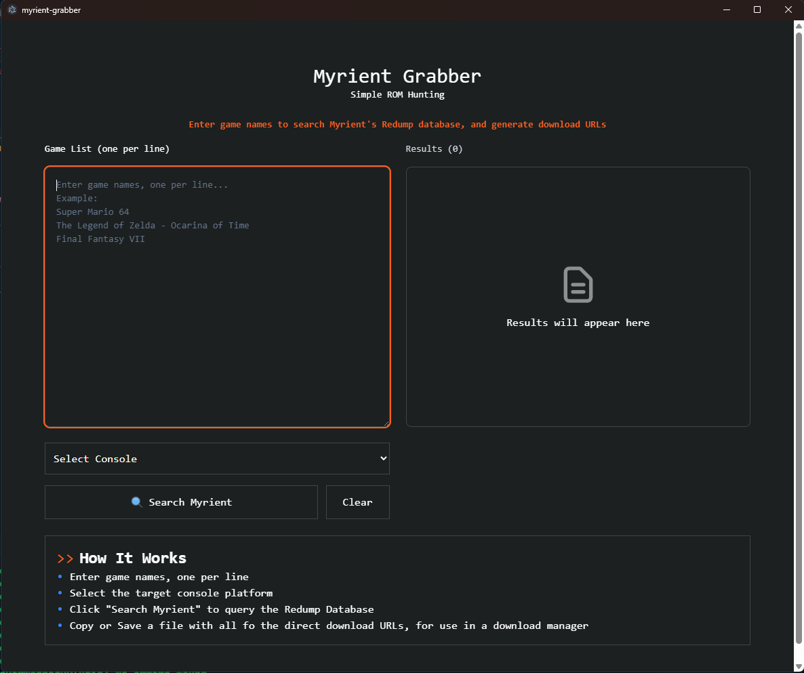

# Myrient Grabber

A desktop application built with Electron, React + TailwindCSS that helps you search and generate download URLs from Myrient's Redump database. Perfect for quickly finding game ROMs and ISOs across multiple consoles.

## Features
- Supports multiple different consoles, allowing you to search through PlayStation/Xbox/etc
- Automatically prioritizes regions (World > USA > Europe > Japan), but you can override it when searching if necessary
- Snags all matches including base games (ISOs) / DLC / special editions / etc
- Export all found URLs to a text file so you can use it with download managers
- Lists of games are cached every program launch, so you're not constantly hounding the Myrient servers



## Installation


1. Clone the repository
```bash
git clone https://github.com/FromDarkHell/Myrient-Grabber
cd myrient-grabber
```

2. Install dependencies
```bash
npm install
```

3. Run / Build
```bash
npm start # Runs the program in development mode
npm run make # Builds the program in release mode
```


## Acknowledgments

Myrient - For hosting the Redump database
Redump - For game preservation efforts

## Contributing

Contributions are welcome! Please feel free to submit a Pull Request!